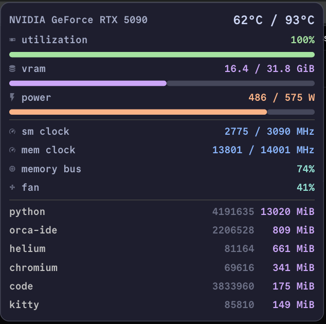
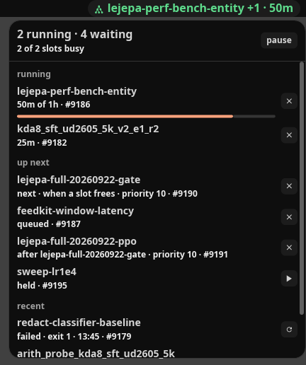

# cosmicbar

A Wayland status bar written as an application instead of a shell-script
harness: Rust and [libcosmic](https://github.com/pop-os/libcosmic) on
`wlr-layer-shell`. Every module reads its own source in-process, and a cell
opens a popup you can click instead of a tooltip you cannot.


| a module's popup | an extension's popup |
| --- | --- |
|  |  |


## Why

Bars like waybar are configured as text: a JSON module list, a CSS file, and a
row of `exec` scripts on timers. That is portable, and it costs an `nvidia-smi`
fork every five seconds, tooltips where an interface belongs, and layout tricks
for anything that is not a label.

- **Push, not poll.** D-Bus, niri's IPC, logind, BlueZ, UPower, NetworkManager,
  MPRIS and the tray all deliver events, so no module sits on an interval and no
  `exec` script runs on a timer. The bar's own clock is a minute-aligned tick for
  the cells that show wall-clock time, and it only goes to one second while a
  playing MPRIS popup or an armed power confirmation is on screen. What the
  kernel exposes no event for is sampled in-process instead - `/proc` for CPU and
  memory, NVML for the GPU, every 2s, no fork per reading - and detail nobody is
  looking at (per-process CPU share, per-process VRAM, DDC values) is only
  gathered while its popup is open. Three things run a program because there is
  no library to call: `ddcutil` for external monitors, whose `detect` retries
  once a minute until one answers, and `checkupdates` plus your AUR helper's
  `-Qua` every 30 minutes.
- **Real widgets.** A cell opens a popup surface with working controls: pick a
  wifi network, connect a headset, switch audio sink, kill a process, jump to a
  window, cancel a queued job. Keybinds can open them without the pointer, and
  the buttons that belong to another program (`walker`, `nmtui`, `bluetoothctl`,
  the upgrade, your locker) hand off to it instead of reimplementing it.
- **Cheap.** Both bars running on the same desktop for 150s
  (`contrib/measure-bar.py`): **0.28% CPU against waybar's 2.43%**, and 59 MB RSS
  against 28 MB at the end of the window. It trades memory for CPU - one process
  with a GPU-less renderer and its own font atlas, instead of GTK plus a script
  per module.
- **Typed configuration.** One `config.toml` and palette roles instead of a CSS
  cascade. A bad file logs and falls back rather than leaving you barless, and
  saving it re-lays out the running bar.

## Install

```bash
cargo install --path .            # ~/.cargo/bin/cosmicbar
```

Rust 1.93+, a Wayland session, and `libpulse` and `libxkbcommon` at build time;
libcosmic itself is fetched from git. Module glyphs need a Nerd Font
(`CommitMono Nerd Font Mono` by default).

Start it from your compositor:

```kdl
spawn-at-startup "/home/you/.cargo/bin/cosmicbar"   # niri
```

`exec-once = cosmicbar` on Hyprland, `exec cosmicbar` on sway.
`contrib/cosmicbar.service` is a systemd user unit, `contrib/niri.kdl` the
keybinds.

## Configure

`~/.config/cosmicbar/config.toml`, re-read when it changes. Every field is
optional and shown below at its default; an unrecognised key is rejected rather
than ignored, and the bar logs and runs on defaults.

```toml
height = 24
font_size = 16.0
font_weight_bold = true
palette = "catppuccin-mocha"   # or catppuccin-latte
terminal = "kitty"
overlay_layer = false          # true to draw over fullscreen windows
outputs = []                   # empty = every monitor
taskbar_scope = "output"       # or "workspace"

left = ["launcher", "taskbar"]
center = ["cpu", "memory", "gpu", "workspaces", "idle_inhibitor", "date", "time",
          "network", "bluetooth", "updates", "notifications", "tray"]
right = ["mpris", "volume", "brightness", "battery", "power"]
```

Placing a module is what starts its subscription; leaving it out costs nothing.

| module | cell | fed by |
| --- | --- | --- |
| `time` | clock | the bar's own tick |
| `date` | date, calendar popup | system clock |
| `workspaces` | per-output pills, click to focus | niri IPC events |
| `taskbar` | this output's windows | niri IPC events |
| `cpu` | package temperature, usage, per-core popup | `/proc/stat`, hwmon |
| `memory` | used/total, breakdown popup | `/proc/meminfo` |
| `gpu` | temperature, utilization, per-process VRAM | NVML |
| `network` | link and addresses, profiles, wifi scan | NetworkManager |
| `bluetooth` | connected count and battery, scan, connect | BlueZ |
| `volume` | sink and source levels, device switching | libpulse |
| `mpris` | what is playing, working transport | MPRIS2 signals |
| `notifications` | do-not-disturb toggle, notification list | mako's D-Bus interface |
| `tray` | tray icons with real menus | StatusNotifierItem host |
| `updates` | pending packages, upgrade in a terminal | `checkupdates` |
| `battery` | charge and time left, peripherals too | UPower |
| `brightness` | panel and external monitor sliders | sysfs, `ddcutil` |
| `idle_inhibitor` | stay-awake toggle | logind inhibitor lock |
| `launcher` | distro badge, quick-launch card | spawns `walker` |
| `power` | lock, log out, suspend, hibernate, reboot, off | logind, niri IPC |

Three cells have nothing to open: `workspaces` and `idle_inhibitor` act on the
click itself, and `time` says all it has to say in the bar.

## Popups from a keybind

```kdl
Mod+Shift+D { spawn "cosmicbar" "toggle" "date"; }
Mod+Shift+Escape { spawn "cosmicbar" "close"; }
```

`cosmicbar toggle <module>`, `close` and `reload` talk to the running bar over a
per-display socket, so the same binds work in a nested session.

## Extensions

Anything the bar does not ship can be another program: it prints one JSON frame
per line and reads popup and click events back. Frames are drawn with the bar's
own widgets and palette, so an extension does not look bolted on.

```toml
right = ["extension:mlq", "volume", "power"]

[[extensions]]
name = "mlq"
command = ["/home/you/.local/bin/cosmicbar-mlq"]
```

`contrib/extensions/cosmicbar-mlq` is a working one in dependency-free Python:
it subscribes to a local ML job queue and gives the bar a cell plus a popup with
per-job cancel buttons - the second screenshot above. Protocol:
[docs/extensions.md](docs/extensions.md).

## Compositor support

Developed and run on niri. The bar itself is plain `wlr-layer-shell`, so
Hyprland, sway and river should work too - untested. Three modules speak niri's
IPC: `workspaces` and `taskbar`, which need compositor state and stay hidden
elsewhere, and `power`, whose *log out* button asks niri to quit (the rest of
that popup is logind). Everything else - D-Bus, `/proc`, sysfs, NVML,
PulseAudio/PipeWire, NetworkManager, BlueZ, UPower - is compositor-agnostic.

## Layout

`src/modules/<name>.rs` is one module: its state, its subscriptions, its bar cell
and its popup, with no shared plumbing to edit. `src/bar.rs` lays regions out
into islands, `src/theme.rs` holds the palette and glyph metrics,
`src/control.rs` is the socket, `src/extension.rs` is the extension protocol.

MIT.
